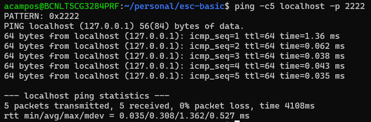

# Server with SSH Service running in a Docker Container

## Requirements
- Docker Installed
- Docker Compose Installed

## Content
1. [Generate SSH RSA key pair](#1-generate-ssh-rsa-key-pair)

2. [Build the centos:ssh image](#2-build-the-centos/systemdssh-image)
    - 2.1 [Dockerfile](#21-dockerfile)
    - 2.2 [Building the image](#22-building-the-image)  
3. [Run the container using docker compose](#3-run-the-container-using-docker-compose)
4. [Connect via ssh with the container ssh server](#4-connect-via-ssh-with-the-container-ssh-server)

## 1. Generate SSH RSA key pair (only if you don't have one yet)
SSH protocol can use public key cryptography for authenticating hosts and users. This configuration improves security by avoiding the need to have password stored in files, and eliminated the possibility of a compromised server stealing the user’s password. For that reason, we should generate SSH public and private key on our client and authorize them into the host. We have choosen SSH RSA algorithm to encrypt the password, but there are others like ed25519.

1. Access / Create the `~/.ssh` folder:
```bash
cd ~/.ssh
```
2. Create the SSH RSA key pair:
```bash
ssh-keygen -t rsa -b 4096 -C your_user
```

>:paperclip: **NOTE:** There is no need to copy the configuration into the sever because we are going to share it using a volume when running the container.

## 2. Build the centos:ssh image
### 2.1 Dockerfile
To run the ssh service inside a container, we have choosen the basic [centos/systemd docker image](https://hub.docker.com/_/centos/systemd/). We have configured the image in order to run the ssh service inside it, and to have the correct files to authenticate the ssh connectivity. [centos/systemd docker image](https://hub.docker.com/_/centos/systemd/) has incorporated the systemd to manage services (like sshd).

To check the modifications take a look into the [Dockerfile](Dockerfile).

I will highlight:
- We modify the configuration of SSH to enable `RSAAuthentication` and `PubkeyAuthentication` while disable `PasswordAuthentication`. Also we configure it to ignore `Rhosts` and permissions to the folder:
```Dockerfile
RUN sed -ri 's/UsePAM yes/UsePAM no/g' /etc/ssh/sshd_config &&\
    echo "RSAAuthentication yes" >> /etc/ssh/sshd_config &&\
    sed -ri 's/PasswordAuthentication yes/PasswordAuthentication no/g' /etc/ssh/sshd_config &&\
    sed -ri 's/#IgnoreRhosts no/IgnoreRhosts yes/g' /etc/ssh/sshd_config
```

### 2.2 Building the image
Build the docker image:
```bash
docker build -t centos:ssh .
```
- user: alex
- password: securepassword

> :paperclip: **NOTE:** To create a custom user and password run the `docker build` command using `--build-arg` and modifying `custom_user` and `custom_password`:
>```bash
> docker build -t centos:ssh --build-arg USER=custom_user --build-arg PSWD=custom_password
>```

## 3. Run the container using docker compose
We have generated a simple [docker-compose.yaml](docker-compose.yaml) file configuring a **bind volume** pointing from the `~/.ssh/id_rsa_shared` of the localhost to the `~/.ssh/authorized_keys` directory of the docker server.

Also, we are using an [.env](.env) to configure [docker-compose.yaml](docker-compose.yaml).

>:paperclip: **NOTE:** by default, docker compose uses the `.env` file for the configuration without use any flag, if we want to use another file we can use it:
>```bash
> docker compose --env-file my-conf-file up
>```

>:warning: **WARNING:** docker compose uses your linux env variables, and linux env vars take precedence over the ones configured in any file. To check the configuration taken by docker compose:
>```bash
> docker compose config
>```

:one: Run the container (as daemon) using `docker compose` with the `-env` configuration file:
```bash
docker compose up -d
```

:two: Check the container is running:
```bash
docker ps
```
:three: Check the container logs:
```bash
docker logs centos_ssh
```
:four: Check the contents of the `/home/$user/.ssh/` folder
```bash
docker exec centos/systemd_ssh ls -la /home/alex/.shh
```

:five: Check the container is running the ssh service
```bash
docker exec centos/systemd_ssh systemctl status sshd.service
```

:six: Check the connectivity using `ping`
```bash
ping -c5 localhost -p 2222
```



## 4. Connect via ssh with the container ssh server

By default, ssh check the following keys:
- `~/.ssh/id_ecdsa`
- `~/.ssh/id_ecdsa_sk`
- `~/.ssh/id_ed25519`
- `~/.ssh/id_ed25519_sk`
- `~/.ssh/id_xmss`
- `~/.ssh/id_xmss`
- `~/.ssh/id_dsa`
- `~/.ssh/id_rsa`

So if our SSH RSA key is not one of the following, the connection will be refused. However, we can pass using the flag `-i` to set the key used to stablish connection.

So run the following command to stablish connection:
```bash
ssh -oPort=2222 -i ~/.ssh/id_rsa_shared alex@localhost
```

If you use a different user:
```bash
ssh -oPort=2222 -i ~/.ssh/id_rsa_shared custom_user@localhost
```

> :warning: **WARNING 1:** If the SSH RSA public and private key are not inside the `~/.ssh/` of the **local machine** and the SSH RSA public key content inside the `~/.ssh/authorized_keys` file of the remote machine the connection will be refused.

> :warning: **WARNING 2:** When changing the docker container configuration, you will receive the following error: **WARNING: REMOTE HOST IDENTIFICATION HAS CHANGED!**
> 
>
> To solve it, you shoul run the following command to reset the host configuration:
> ```bash
>ssh-keygen -f "/home/acampos/.ssh/known_hosts" -R "[localhost]:2222"
>```
> And run again the ssh command:
> ```bash
>ssh -oPort=2222 -i ~/.ssh/id_rsa_shared custom_user@localhost
>```