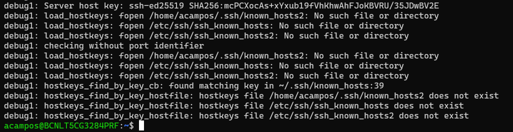

# Server with SSH Service running in a Docker Container

## Requirements
- Docker Installed

## Content
1. [Generate SSH RSA key pair](#1-generate-ssh-rsa-key-pair)

2. [Build the ubuntu:ssh image](#2-build-the-ubuntussh-image)
    - 2.1 [Dockerfile](#21-dockerfile)
    - 2.2 [Building the image](#22-building-the-image)  
3. [Run the container using docker run](#3-run-the-container-using-docker-run)
4. [Connect via ssh with the container ssh server](#4-connect-via-ssh-with-the-container-ssh-server)

## 1. Generate SSH RSA key pair
SSH protocol can use public key cryptography for authenticating hosts and users. This configuration improves security by avoiding the need to have password stored in files, and eliminated the possibility of a compromised server stealing the user’s password. For that reason, we should generate SSH public and private key on our client and authorize them into the host. We have choosen SSH RSA algorithm to encrypt the password, but there are others like ed25519.

:one: Access / Create the `~/.ssh` folder:
```bash
cd ~/.ssh
```
:two: Create the SSH RSA key pair:
```bash
ssh-keygen -t rsa -b 4096 -f ./id_rsa_shared
```
> :paperclip: **NOTE:** To add more security, it will ask you to create a password for the keys, but if you don't want, just entre to keep it empty.

It should have generated two keys, the public one and the private one:


## 2. Build the ubuntu:ssh Image
### 2.1 Dockerfile
To run the ssh service inside a container, we have choosen the basic [ubuntu docker image](https://hub.docker.com/_/ubuntu/). We have configured the image in order to run the ssh service inside it, and to have the correct files to authenticate the ssh connectivity.

To check the modifications take a look into the [Dockerfile](Dockerfile).

I will highlight:
- We modify the configuration of SSH to enable `RSAAuthentication` and `PubkeyAuthentication` while disable `PasswordAuthentication`. Also we configure it to ignore `Rhosts` and permissions to the folder:
```Dockerfile
RUN echo "Host remotehost\n\tStrictHostKeyChecking no\n" >> /home/${USER}/.ssh/config &&\
    sed -ri 's/UsePAM yes/UsePAM no/g' /etc/ssh/sshd_config &&\
    echo "RSAAuthentication yes" >> /etc/ssh/sshd_config &&\
    sed -ri 's/#PasswordAuthentication yes/PasswordAuthentication no/g' /etc/ssh/sshd_config &&\
    sed -ri 's/#IgnoreRhosts yes/IgnoreRhosts yes/g' /etc/ssh/sshd_config
```

### 2.2 Building the image
Pull the image centos/systemd:
```bash
docker pull ubuntu:latest
```
Build the docker image with the default user and password defined:
```bash
docker build -t ubuntu:ssh .
```
- user: alex
- password: securepassword

> :paperclip: **NOTE:** To create a custom user and password run the `docker build` command using `--build-arg` and modifying `custom_user` and `custom_password`:
>```bash
> docker build -t ubuntu:ssh --build-arg USER=custom_user --build-arg PSWD=custom_password
>```

## 3. Run the container using docker run 
:one: Run the container (without daemon) using docker run:
```bash
docker run --rm -d --name ubuntu_ssh -p 2222:22 -v ~/.ssh/id_rsa_shared.pub:/home/alex/.ssh/authorized_keys:ro ubuntu:ssh
```
You can observe that the container starts the SSH service and gets in stand by:


:two: Check the container is running:
```bash
docker ps
```


:three: Check the contents of the `/home/$user/.ssh/` folder
```bash
docker exec ubuntu_ssh ls -la /home/alex/.shh
```


:four: Check the container is running the ssh service
```bash
docker exec ubuntu_ssh service ssh status
```


:five: Check the connectivity using `ping`
```bash
ping -c5 localhost -p 2222
```


## 4. Connect via ssh with the container ssh server
By default, ssh check the following keys:
- `~/.ssh/id_ecdsa`
- `~/.ssh/id_ecdsa_sk`
- `~/.ssh/id_ed25519`
- `~/.ssh/id_ed25519_sk`
- `~/.ssh/id_xmss`
- `~/.ssh/id_xmss`
- `~/.ssh/id_dsa`
- `~/.ssh/id_rsa`

So if our SSH RSA key is not one of the following, the connection will be refused. However, we can pass using the flag `-i` to set the key used to stablish connection.

So run the following command to stablish connection:
```bash
ssh -oPort=2222 -i ~/.ssh/id_rsa_shared alex@localhost
```


>:paperclip: If you run the command without specifying user, ssh will take your Linux current user, in my case `acampos`:
> 

If you use a different user:
```bash
ssh -oPort=2222 -i ~/.ssh/id_rsa_shared custom_user@localhost
```

> :warning: **WARNING 1:** If the SSH RSA public and private key are not inside the `~/.ssh/` of the **local machine** and the SSH RSA public key content inside the `~/.ssh/authorized_keys` file of the remote machine the connection will be refused.

> :warning: **WARNING 2:** When changing the docker container configuration, you will receive the following error: **WARNING: REMOTE HOST IDENTIFICATION HAS CHANGED!**
> 
>
> This message appears when you try and connect over SSH to a remote server, and there's a mismatch between the server's public key and what's stored on your local machine.
> To solve it, you shoul run the following command to reset the host configuration:
> ```bash
>ssh-keygen -f "/home/acampos/.ssh/known_hosts" -R "[localhost]:2222"
>```
> And run again the ssh command:
> ```bash
>ssh -oPort=2222 -i ~/.ssh/id_rsa_shared custom_user@localhost
>```
> You can configure your local host to skip this message and continue with ssh connection, just add to the `~/.ssh/config` file with the following lines:
>```config
>Host localhost
>    StrictHostKeyChecking no
>```