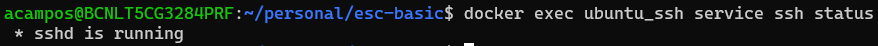

# Server with SSH Service running in a Docker Container

## Requirements
- Docker Installed

## Contents
1. [SSH Default Config](#1-ssh-default-config)
2. [Build the ubuntu:ssh image](#2-build-the-ubuntussh-image)
    - 2.1 [Dockerfile](#21-dockerfile)
    - 2.2 [Building the image](#22-building-the-image)
3. [Run the container using docker run](#3-run-the-container-using-docker-run)
4. [Connect via ssh with the container ssh server](#4-connect-via-ssh-with-the-container-ssh-server)

## 1. SSH Default Config
By default SSH protocol doesn't use public key cryptography for authenticating hosts and users. It still uses the Linux user-password authentication method, so you only have to pass the `username` of the Linux user via the ssh command and introduce the `password` of this user.

## 2. Build the ubuntu:ssh image
### 2.1 Dockerfile
To run the ssh service inside a container, we have choosen the basic [ubuntu docker image](https://hub.docker.com/_/ubuntu/). We have configured the image in order to run the ssh service inside it, and to have the correct files to authenticate the ssh connectivity.

To check the modifications take a look into the [Dockerfile](Dockerfile).

### 2.2 Building the image
Build the docker image with the default user and password defined:
```bash
docker build -t ubuntu:ssh .
```
- user: alex
- password: securepassword

> :paperclip: **NOTE:** To create a custom user and password run the `docker build` command using `--build-arg` and modifying `custom_user` and `custom_password`:
>```bash
> docker build -t ubuntu:ssh --build-arg USER=custom_user --build-arg PSWD=custom_password
>```

## 3. Run the container using docker run 
:one: Run the container (as daemon) using docker run:
```bash
docker run -d --rm --name ubuntu_ssh -p 2222:22 ubuntu:ssh
```

:two: Check the container logs, you should see:


:three: Check the container is running:
```bash
docker ps
```


> :paperclip: **NOTE:** If the container is not running, you can run it again without `-d` flag, to see the logs directly:
>```bash
>docker run -d --rm --name ubuntu_ssh -p 2222:22 ubuntu:ssh
>```
>

:four: Check the contents of the `/home/$user/.ssh/` folder
```bash
docker exec ubuntu_ssh ls -la /home/alex/.shh
```


:five: Check the container is running the ssh service
```bash
docker exec ubuntu_ssh service ssh status
```


:six: Check the connectivity using `ping`
```bash
ping -c5 localhost -p 2222
```


## 4. Connect via ssh with the container ssh server
- If you have the default configuration
```bash
sshpass -p securepassword ssh -oPort=2222 alex@localhost
```


> :paperclip: **NOTE:** Sometimes I don't know why this method does not work, so try it with user and password manually:
>```bash
>ssh -oPort=2222 alex@localhost
>```
>And then enter the password: `securepassword`

- If you have modified the configuration
```bash
ssh -oPort=custom_port custom_user@localhost
```

And then enter the password: `custom_password`